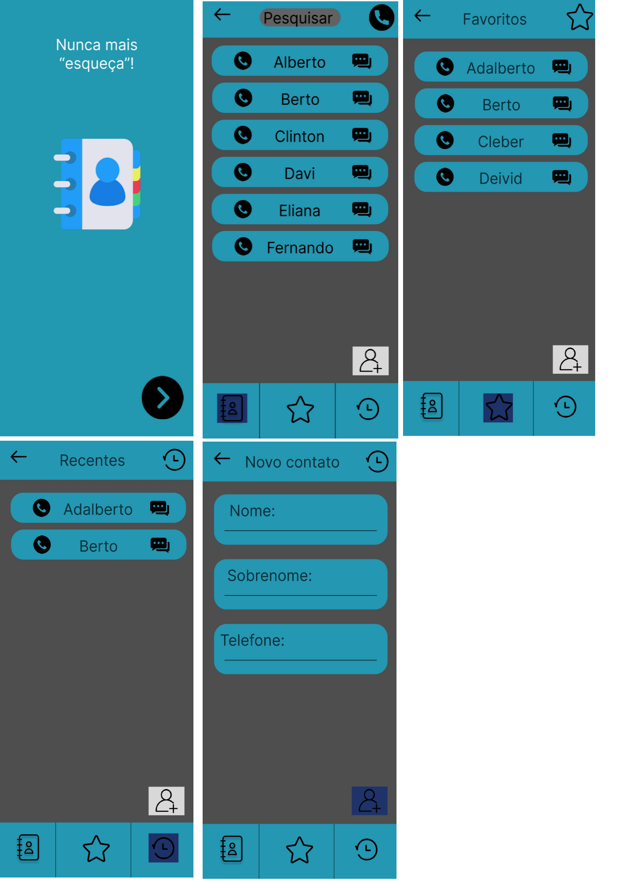

## Introdução:

Projeto requisitado pelo professor de desenvolvimento mobile como requisito para conclusão de disciplina.

### Projeto proposto: Aplicação Mobile 

### Softwares utilizados:
- VSCode;
- Figma;
- React Native;
- Expo.

### A aplicação deve:

- Implementar uma agenda funcional utilizando o modelo feito no figma como base.

# Modelo base:

# Resultado após modificações:

## Observações:
- Não necessário implementar favoritos ou recentes;
- Necessidade de aceitar múltiplos telefones, endereços e e-mails;
- Persistência de dados utilizando biblioteca Async Storage.