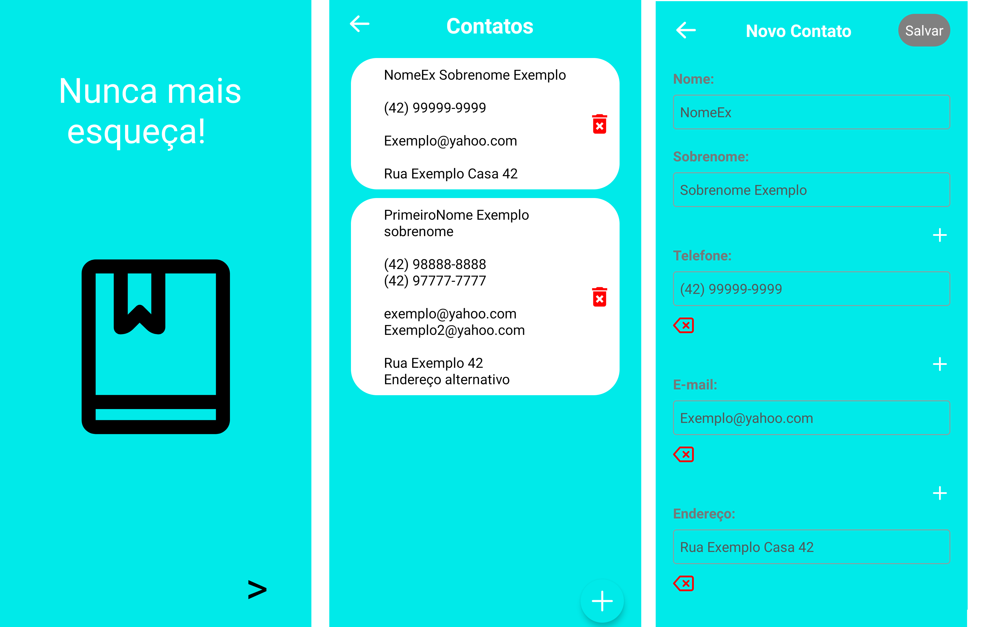

 &nbsp;

<a href="#sobre"> Sobre </a> &nbsp;&nbsp; | &nbsp;&nbsp;
<a href="#tecnologias-utilizadas"> Tecnologias </a> &nbsp;&nbsp; | &nbsp;&nbsp;
<a href="#como-executar-o-projeto"> Como executar</a> &nbsp;&nbsp; | &nbsp;&nbsp;
<a href="#docker"> Executar com Docker </a> &nbsp;&nbsp; | &nbsp;&nbsp;
<a href="#resultado"> Resultado </a> &nbsp;&nbsp; | &nbsp;&nbsp;

# Sobre
Aplicação mobile de agenda de contatos.

Projeto requisitado pelo professor de Desenvolvimento Mobile como requisito para conclusão de disciplina.
# Tecnologias utilizadas

 

# Como executar o Projeto

### Docker

# Resultado

